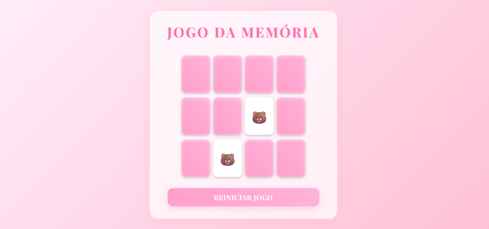

# Jogo da Memória

Um jogo da memória interativo desenvolvido com HTML, CSS e JavaScript vanilla.



## Descrição

Jogo clássico de memória onde o objetivo é encontrar todos os pares de cartas iguais. As cartas começam viradas para baixo e o jogador deve clicar nelas para revelá-las, tentando encontrar os pares correspondentes.

## Funcionalidades

- Interface kawaii com design em tons de rosa
- Animações suaves de flip 3D nas cartas
- Sistema de verificação automática de pares
- Botão para reiniciar o jogo
- Embaralhamento aleatório das cartas
- Mensagem de vitória ao completar o jogo

## Tecnologias Utilizadas

- HTML5
- CSS3 (Flexbox, Transforms, Transitions)
- JavaScript (ES6)

## Como Executar

1. Clone o repositório
2. Abra o arquivo `index.html` em seu navegador
3. Comece a jogar clicando nas cartas

## Estrutura do Projeto

```
dio-memory-game/
├── index.html
└── src/
    ├── scripts/
    │   └── engine.js
    └── styles/
        ├── main.css
        └── reset.css
```


